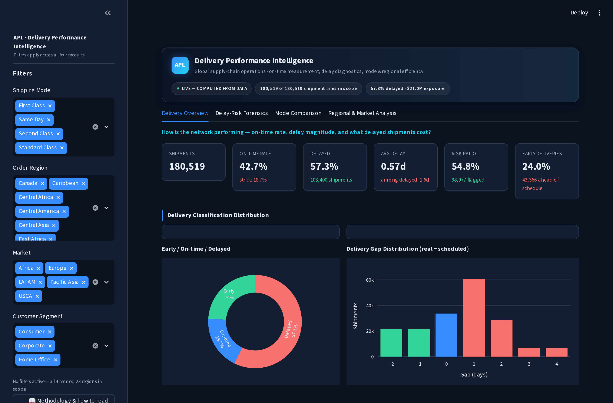
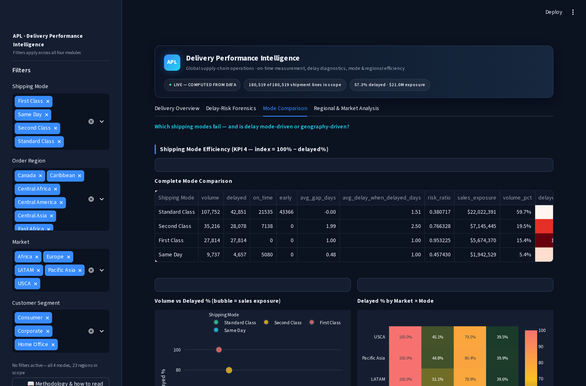
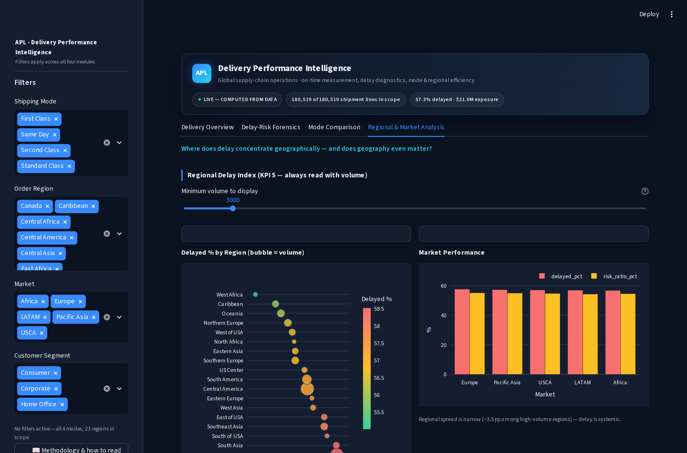

# Delivery Performance, Delay Risk & Logistics Efficiency — Global Supply Chain Analytics

[](https://github.com/rishi-1603/Delivery-Performance-Delay-Risk-and-Logistics-Efficiency-Analysis-in-Global-Supply-Chain-Operations/actions/workflows/ci.yml)
[](https://www.python.org/)
[](#testing--ci)

End-to-end business-intelligence product over **180,519 order-item shipment lines** (23 regions · 5 markets · 164 countries · 4 shipping modes): a reproducible cleaning pipeline, a five-KPI engine, diagnostic analytics, a SQL layer that mirrors every Python calculation, a 4-module Streamlit dashboard, and **23 automated tests that pin every headline number to the dataset** — the dashboard cannot silently disagree with the data.

---

## Headline results (all test-pinned)

| Metric | Value |
|---|---|
| On-time delivery rate (delivered no later than scheduled) | **42.72%** |
| Delayed shipment lines | **103,400 (57.28%)** |
| Average delivery delay (mean gap) | 0.566 days |
| Average delay among delayed shipments | 1.617 days |
| Late-delivery-risk ratio (dataset flag) | 54.83% (98,977 lines) |
| Sales tied to delayed lines | **$21.0M of $36.8M (57.2%)** |

### Three findings that drive the recommendations

1. **First Class is structurally broken — 100.00% delayed.** All 27,814 First Class lines arrive late, in every one of the 5 markets. That is a systematically unachievable scheduling promise, not a performance problem ($5.7M in sales exposure).
2. **Delay is mode-driven, not geography-driven.** Delayed rates span **60 percentage points across shipping modes** but only **3.5 pp across high-volume regions** (~55–58.5% everywhere). The lever is mode allocation policy, not regional firefighting.
3. **The dataset's risk flag is fully explained.** `Late_delivery_risk = 1` maps exactly to `Delivery Status = 'Late delivery'` (98,977 = 98,977). All 4,423 disagreements with the gap-based classification are canceled shipments — a reporting-hygiene finding, not a data-quality mystery.

## Repository structure

```
├── dashboard/app.py      # 4-module Streamlit BI dashboard (Plotly)
├── scripts/              # 01_clean_data.py · 02_analysis_report.py
├── src/                  # config · data_cleaning · kpis · analytics · data_access
├── sql/                  # schema.sql · kpis.sql · analysis.sql (mirrors the Python)
├── tests/                # 23 tests — classification, cleaning, KPIs, data access
├── docs/                 # methodology, dictionaries, exec summary, research paper, …
├── reports/              # generated reports (deterministic — CI-verified)
└── data/                 # raw + processed (gitignored — see Data & reproduction)
```

## Quickstart (local)

```bash
git clone https://github.com/rishi-1603/Delivery-Performance-Delay-Risk-and-Logistics-Efficiency-Analysis-in-Global-Supply-Chain-Operations.git
cd Delivery-Performance-Delay-Risk-and-Logistics-Efficiency-Analysis-in-Global-Supply-Chain-Operations
pip install -r requirements.txt

# 1. Get the dataset (62.5 MB — stored as a GitHub Release asset, not in git)
mkdir -p data/raw
curl -fSL -o data/raw/APL_Logistics.csv \
  "https://github.com/rishi-1603/Delivery-Performance-Delay-Risk-and-Logistics-Efficiency-Analysis-in-Global-Supply-Chain-Operations/releases/download/data-v1/APL_Logistics.csv"

# 2. Build the processed dataset + reports (deterministic)
python scripts/01_clean_data.py
python scripts/02_analysis_report.py

# 3. Run the test suite (23 tests)
python -m pytest tests/ -v

# 4. Launch the dashboard
streamlit run dashboard/app.py
```

## Dashboard — 4 modules (Streamlit + Plotly)







| Module | What it answers |
|---|---|
| **Delivery Overview** | On-time / delayed / early split, delay magnitude, both bases (all rows vs delivered-only) |
| **Delay-Risk Forensics** | Is `Late_delivery_risk` trustworthy? Risk-vs-classification cross-tab + the canceled-shipment explanation |
| **Mode Comparison** | Efficiency index per shipping mode — the First Class failure and the Standard Class advantage |
| **Regional Analysis** | Volume-aware regional delay index — proving the problem is systemic, not regional |

Cross-filters: shipping mode · region · market · customer segment. There is **no date filter — the dataset has no date column** (documented limitation, not hidden).

## Methodology (short version — full detail in [docs/methodology.md](docs/methodology.md))

- **Grain:** one row = one order-item shipment line. The dataset has no Order Id, so every KPI is per-line and labeled as such — no silent order-level claims.
- **Classification:** `gap = Days for shipping (real) − Days for shipment (scheduled)` → Early (<0) / On-time (=0) / Delayed (>0). Pinned counts: 43,366 / 33,753 / 103,400.
- **Canceled shipments (7,754 rows):** flagged (`is_canceled`), never deleted. Official KPIs use all rows; a delivered-only sensitivity view runs alongside (headline rate moves 57.28% → 57.29% — conclusions robust to the choice).
- **Country standardization:** `EE. UU.` (Spanish for USA) → `United States` — logged; accented Order Country names preserved as-is.
- **No imputation theater:** 8 missing last names and 3 missing zip codes left as-is — neither affects a delivery KPI.

## Data & reproduction

- **Dataset:** 180,519 rows × 40 columns, latin-1 encoded, supplied with the official project specification (DataCo supply-chain shipment dataset — **synthetic/public, framed as an APL Logistics case study**; not real company data).
- Stored as Release asset [`data-v1`](https://github.com/rishi-1603/Delivery-Performance-Delay-Risk-and-Logistics-Efficiency-Analysis-in-Global-Supply-Chain-Operations/releases/tag/data-v1) because 62.5 MB is too large for dependable git checkouts.
- The pipeline is **deterministic**: CI regenerates `reports/` and fails the build if they differ by a single byte from the committed versions.
- Known limitations (documented, not hidden): no date column → no trend analysis; no order key → per-line rates only; no penalty/refund data → **$21.0M is exposure, not confirmed loss**.

## Documentation

| Doc | Contents |
|---|---|
| [docs/executive_summary.md](docs/executive_summary.md) | One-page management summary + prioritized actions |
| [docs/methodology.md](docs/methodology.md) | Grain decision, classification, canceled handling, every rule |
| [docs/data_dictionary.md](docs/data_dictionary.md) | All 40 raw + 3 derived columns |
| [docs/kpi_dictionary.md](docs/kpi_dictionary.md) | The five KPIs — formulas, both bases |
| [docs/research_paper.md](docs/research_paper.md) | Full research write-up (abstract → conclusion) |
| [docs/interview_prep.md](docs/interview_prep.md) | 60-second walkthrough + hard questions |
| [reports/analysis_report.md](reports/analysis_report.md) | Generated analysis report (deterministic) |
| [reports/data_quality_report.md](reports/data_quality_report.md) | Transformation log + known limitations |

## Testing & CI

**23 tests** in `tests/` cover: the official classification rules, cleaning reproducibility (shape, duplicates, country standardization, cancel flags), every KPI pinned to exact dataset values, the risk-flag audit, and the dashboard's data-access path.

CI ([`.github/workflows/ci.yml`](.github/workflows/ci.yml)) downloads the full dataset from the Release asset, runs the complete pipeline, verifies the reports regenerate byte-identical, runs all 23 tests, and smoke-tests the dashboard end-to-end with Streamlit's AppTest — no test is skipped, no number is stubbed.

## Deploying (Streamlit Cloud)

The repo is deploy-ready. The raw dataset is intentionally not in git, so on first load the app downloads the pinned Release asset and cleans it in memory (cached for the container's lifetime — the first request takes ~30–60 s, subsequent loads are instant). **New app → this repo → main file `dashboard/app.py` → deploy.** `requirements.txt` is complete; no secrets or config needed.

---

**Author:** Dappu Rishi Raghukumar · [LinkedIn](https://www.linkedin.com/in/rishidappu1603) · [GitHub](https://github.com/rishi-1603) · MIT License
